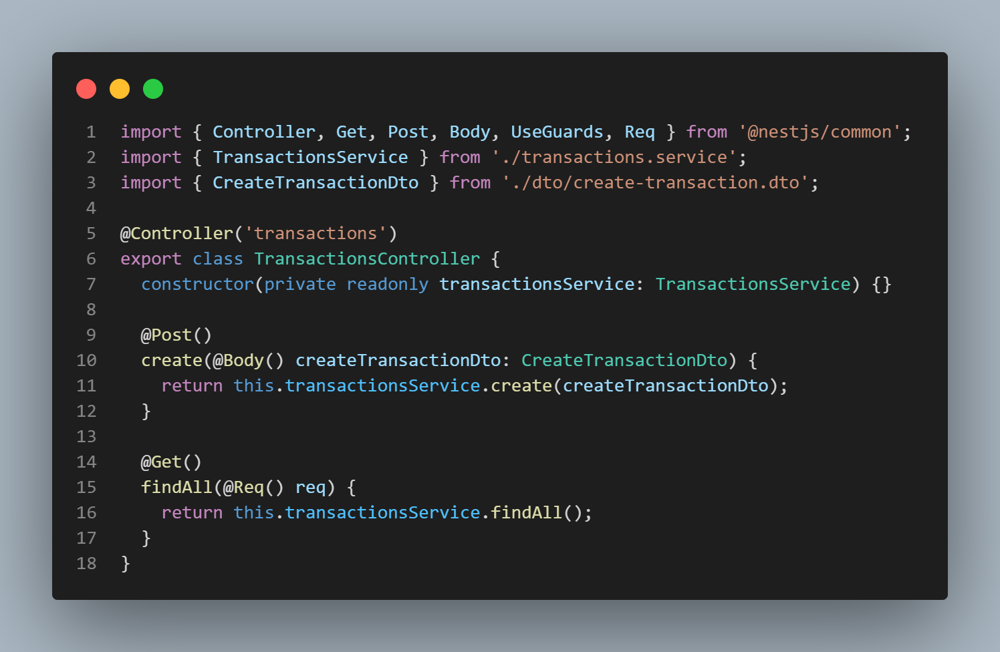

  

[circleci-image]: https://img.shields.io/circleci/build/github/nestjs/nest/master?token=abc123def456
[circleci-url]: https://circleci.com/gh/nestjs/nest

  
Imersão 4 Full Cycle - Desafio 1 - Criando API REST com Nest.js .

By: Bruno Kinoshita

Code Snap:

